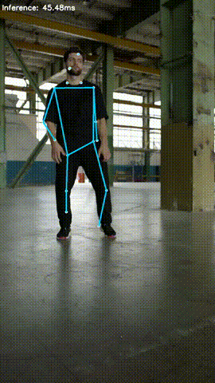

# TensorRT Examples

## About
TensorRT examples (Python/C++)

## List of samples

|Pose estimation|
|:--|:--|
|[TensorFLow Lite to TensorRT PoseNet](python/posenet/README.md)
||

## LICENSE
The following files are licensed under [NVIDIA/TensorRT](https://github.com/NVIDIA/TensorRT).
- [common.py](posenet/common.py)
  
## Reference
- [TensorRT](https://github.com/NVIDIA/TensorRT)
- [ONNX](https://github.com/onnx/onnx)
- [ONNX Runtime](https://github.com/microsoft/onnxruntime)
- [tf2onnx](https://github.com/onnx/tensorflow-onnx)
- [TensorRT Backend For ONNX](https://github.com/onnx/onnx-tensorrt)
- [TensorFlow Model Garden](https://github.com/tensorflow/models)
